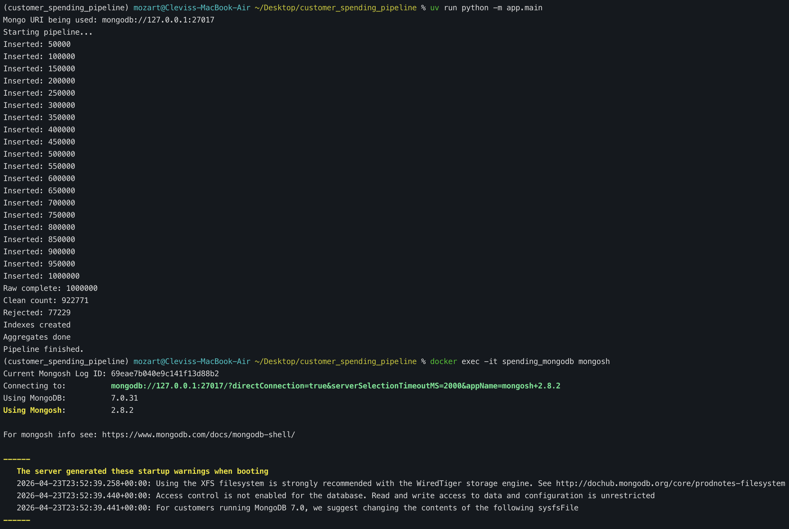
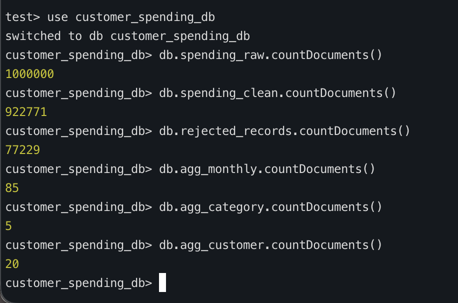

# Customer Spending Analytics Pipeline

## Project Overview
This project implements a full Big Data pipeline using MongoDB to process and analyze 1 million customer spending transactions from 2018–2025. 

The system ingests raw data, cleans and validates records, stores structured data, and generates aggregated insights that are visualized through a dashboard.


## Platform Chosen and Why
**MongoDB** was selected as the primary platform because:

- It efficiently handles large-scale, semi-structured data
- JSON-style documents match the structure of transaction records
- Built-in aggregation pipelines allow fast analytics
- Indexing improves query performance for large datasets

MongoDB provides flexibility and scalability needed for Big Data processing.


## Dataset Description
- Dataset: Customer Spending (1,000,000 records)
- Time Range: 2018–2025

### Key Fields:
- Transaction_ID
- Transaction_date
- Gender
- Age
- State_names
- Segment
- Payment_method
- Amount_spent

This dataset is large and complex enough to require proper data cleaning, validation, and aggregation.


## Architecture
Pipeline flow:

``` bash
CSV Dataset
↓
Raw MongoDB Collection
↓
Cleaning + Validation (Pydantic)
↓
Clean MongoDB Collection
↓
Aggregation Layer
↓
Streamlit Dashboard
```

The system uses Docker to run MongoDB locally and Python to handle ingestion, processing, and analytics.

## Setup Instructions

### Clone Repository

git clone https://github.com/motacl35/customer-spending-mongodb-pipeline

``` bash
1. cd customer-spending-mongodb-pipeline
2. Install Dependencies
    - uv venv
    - source .venv/bin/activate
    - uv add pandas pymongo pydantic python-dotenv
    streamlit matplotlib pytest mypy
3. Start MongoDB
    - docker compose up -d
    - Pipeline Stages
1. Raw Layer
    - Loads 1,000,000 records into MongoDB
    - Stores original dataset without modification
2. Clean Layer
- Removes duplicates
- Normalizes text values
- Converts date formats
- Adds derived fields:
    - year
    - month
    - spending_level
    - Validates records using Pydantic
    - Stores invalid records in a rejected_records collection
3. Aggregated Layer

Creates summary datasets:

- Monthly spending trends
- Spending by customer segment
- Top states by total spending

These aggregated collections are stored back into MongoDB.

```


# Screenshots

## Running


## Test


Examples to include:

MongoDB collection counts
Sample documents
Aggregated data
Dashboard visuals
Team Members

## Team members
- Clevis Mota  
- Jackson Downing   
- William Drain 
